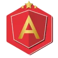
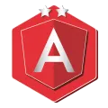

## Bootcamp Avanade - decola-tech-2025

Este projeto tem como objetivo registrar todos os meus aprendizados durante a conclusão do bootcamp Avanade - Decola Tech 2025 na plataforma DIO. O bootcamp abrange tecnologias essenciais para o mercado de desenvolvimento, incluindo Java, Angular e Inteligência Artificial (IA), com o curso preparatório AI-900.

## :telephone_receiver: Contato
Caso tenha dúvidas ou sugestões, fique à vontade para entrar em contato comigo através das minhas redes sociais:

[%2091356--4300-%237289DA?logo=whatsapp)](https://wa.me/+5511913564300)

### Idiomas - Languages

    Português - Nativo

 

    English - Intermediary

## 🚀 Tecnologias Aprendidas

- Java: Programação orientada a objetos, frameworks como Spring Boot, manipulação de APIs RESTful e integração com bancos de dados.
- Angular: Desenvolvimento de aplicações web modernas, arquitetura baseada em componentes e consumo de APIs.
- Inteligência Artificial (AI-900): Fundamentos da IA, aprendizado de máquina, serviços de IA no Azure e aplicações práticas.

  
  
  
  
  
  
  
  
  
  
  

## 📚 Conteúdos e Projetos Desenvolvidos

Durante o bootcamp, foram realizados diversos desafios práticos, projetos e estudos aprofundados. Alguns dos tópicos abordados incluem:

- ✅ Introdução ao Java e sua aplicação no desenvolvimento backend.
- ✅ Criação e consumo de APIs RESTful com Spring Boot.
- ✅ Estruturação de aplicações escaláveis utilizando Angular.
- ✅ Conceitos fundamentais de Inteligência Artificial com o AI-900.
- ✅ Utilização do Microsoft Azure para soluções baseadas em IA.
- ✅ Projetos práticos para consolidar o conhecimento adquirido.

## 🎯 Minha Experiência no Programa

Aqui, vou compartilhar minhas impressões sobre o bootcamp, destacando os pontos que mais gostei, desafios que enfrentei e como essa experiência contribuiu para o meu crescimento profissional.
